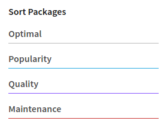
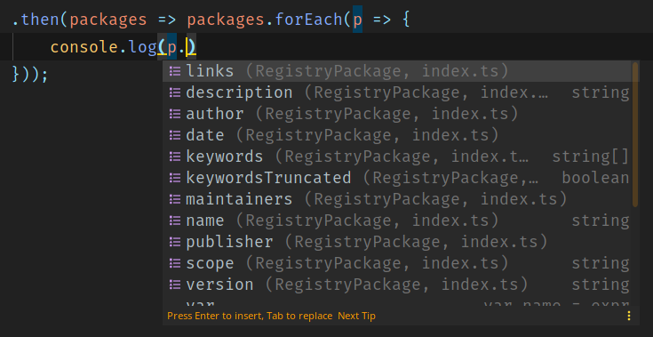

# Search npm packages

Promise based package for searching other npm packages in registry.
With rating search support as on the npmjs.com



## Instalation
```shell script
npm i search-npm-packages
# or if you using yarn
yarn add search-npm-packages
```

## Usage


```javascript
const npmSearch = require('search-npm-packages')
```

Or import using TypeScript or ESM

```typescript
import npmSearch from 'search-npm-packages'
```

### Simple search by name

The output will be an array with packages from the register

```typescript
npmSearch({ name: 'telegram' })
    .then(packages => console.log(packages))
    .catch(e => console.error(e))

// output:
/*[
    {
      name: 'telegram',
      scope: 'unscoped',
      version: '1.0.0-alpha.2',
      description: 'NodeJS MTProto API Telegram client library,',
      date: { ts: 1575163205790, rel: '2 months ago' },
      links: {
        npm: 'https://www.npmjs.com/package/telegram',
        homepage: 'https://github.com/gram-js/gramjs#readme',
        repository: 'https://github.com/gram-js/gramjs',
        bugs: 'https://github.com/gram-js/gramjs/issues'
      },
      publisher: {
        name: 'youtwitface',
        avatars: [Object],
        created: [Object],
        email: 'contact@lungers.com'
      },
      maintainers: [ [Object] ],
      keywordsTruncated: false,
      keywords: []
    },
    {
      name: 'winston-telegram',
      scope: 'unscoped',
      version: '2.2.2',
    ...
*/
```

### Search by keywords

For search by keywords use `keywords` option.

> if use the `name` and `keywords` option at the same time. The search will be performed by keywords

```javascript
npmSearch({ keywords: ['backend', 'cli'] })
    .then(packages => console.log(packages))
    .catch(e => console.error(e))

// output:
/*[
    {
        name: '@rucken/cli',
        scope: 'rucken',
        version: '4.1.5',
        description: 'Console tools for create and build Angular7+, Bootstrap, Ionic and NestJS application based on Rucken template',
        keywords: [
          'cli',       'nx',
         'workspace', 'ngx',
         'angular7',  'nestjs',
          'ionic',     'bootstrap',
          'rucken',    'admin',
         'ui',        'backend',
         'mobile',    'frontend'
        ],
        date: { ts: 1557580280060, rel: '9 months ago' },

        ...
*/
```

### Ranking search

You can use ranking search as on the npmjs.com


`ranking` can be `optimal`, `popularity`, `quality` or `maintenance`.

```javascript
npmSearch({
    name: 'torrent',
    ranking: "quality"
})
    .then(packages => packages.forEach(p => {
        console.log(p.links.npm)
    }))

// output:
/*
https://www.npmjs.com/package/torrent
https://www.npmjs.com/package/torrent-extract-hash
https://www.npmjs.com/package/magnet2torrent
...
*/
```

### TypeScript

This package with full TypeScript support. And your IDE can use autocomplete.



Also you can import `RegistryPackage` type, and `NpmSearchParams`
```typescript
import { RegistryPackage, NpmSearchParams } from "search-npm-packages";
```
